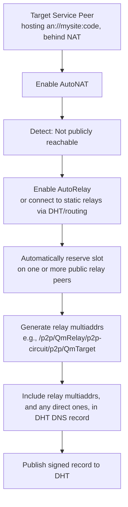
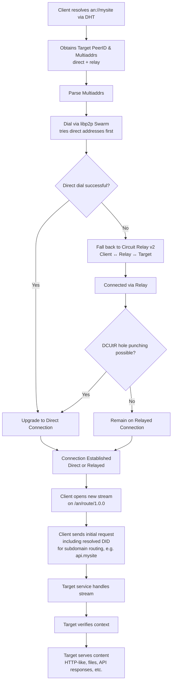

> [!IMPORTANT]  
> Read project notes and updates regarding the first version of the [Alternet Proof of concept implementation](https://github.com/ravendevteam/alternet-docs).
> All current information withtin this repo (from before: 03/12/25) is considered deprecated and is not indicative of the current state.

# Overview

- Alternet is a decentralized networking protocol/architecture meant to replace the current HTTP and DNS stack, which has become easy for governments and corporations to censor or monitor.

- It removes central authorities and single points of failure by using cryptographic identities and distributed routing instead of hierarchical services.

- The design focuses on strong privacy, resistance to control, and the ability to keep working even under hostile conditions. 

- Its deterrent model, based on the concept of Mutually Assured Destruction, ensures that attempts to suppress the network would harm the attacker as much as the target, making censorship impractical. 

The specification and a proof-of-concept implementation are currently in active development.

# Update 04/02/2026: DHT DNS System Design Update.


# Implementation

We've decided that we're going to build the systems for Alternet using the Libp2p Rust Library.
This provides us with a solid framework (rather than reinvent the wheel) for building the decentralized systems that AlterNet requires to function.  

Libp2p is an open source, modular networking stack used by popular distributed systems. Such as Ethereum and IFPS.
It provides support for global scale Peer to Peer networking, Pub-Sub messaging, Distributed Hash Tables (DHT), NAT Hole Punching and browser-browser direct communication.

Why though?

1. It's **modular**. We only need to use specific parts of the Rust libp2p implementation to build AlterNet.
2. **Transport Compatibility**. Allowing alternet to operate in various runtime and network conditions.
3. **Security**: Out of the box security implementations. 
	- Peer identity verification, via public key cryptography
	- End to End encryption between peers using modern standards
4. **It's Robust**: Libp2p is designed to withstand stress, disturbance and change. It can recover quickly from disruptions or failures. It also implements a range of mitigation techniques to help protect against network attacks. This required to ensure the survival of Alternet.
5. **Peer to Peer Design**: P2P networks are often more resilient than traditional client/server networks. There is no single point of failure (*think about what happens when Cloudflare shits the bed*). Libp2p allows AlterNet to still function and be accessible even if some peers are offline or unreachable.
	1. This also leads to inherent efficiency on the network, as data is distributed across the network, rather than stored on a central server. DNS records on alternet won't be stored in place only, rather they would be spread out.
6. **NAT Traversal**: Instead of spending 20,000 hours figuring out NAT traversal in Rust, libp2p provides us that functionality with a warm loving embrace. This maintains connectivity for peers behind routers and firewalls. 
7. **The Magic of GossipSub**: One module available thanks to Libp2p, is GossipSub. It adopts a pubsub (publish subscribe) architecture, which allows a sender (publisher) to send a message to multiple recipients (subscribers) without the publisher needing to know the subscribers are. This is useful for when a peer needs to exchange data to others.
8. **Ecosystem**: Libp2p is implemented not only in Rust. You can build alternet applications in a multitude of languages. This helps promote a healthy ecosystem for Alternet.


Peer to peer networks are decentralized. No central authority or server controls the network. The goal of AlterNet is to move away from the traditional "client-server" model, while still allowing regular "internet use". Libp2p allows us to build in this way.


## Decentralized DNS 
The DNS of Alternet will be implemented as a Distributed Hash Table.

### Distributed Hash Table
The **Kademlia Distributed Hash Table** is used in libp2p.

In simple terms, a hash table is a set of records in which every record holds a `key -> value` mapping. In a distributed hash table, the **records are spread across the network**, which means that every node holds a subset of records.

When searching for a specific record, we do not have a centralized registry; therefore, we must ask peers in the network until the record is found. This search is not random however, but guided by the DHT distance metric. 

Nodes store data based on how "close" a key is to their own ID.
XOR Distance measures this closeness: 

Take two IDs (binary numbers), apply bitwise XOR (where matching bits = 0, differing bits = 1), and interpret the result as an integer.
- Smaller Number = closer (fewer differing bits, especially in higher positions)
- 0 = identical IDs
- Larger number = Farther.

Nodes store keys with the smallest XOR to their ID. To store/retrieve data, find the closest nodes to the key's hashed ID.
This enables efficient, decentralized lookup without central servers.

### Implementation Overview

This decentralized DNS system, built on a Distributed Hash Table (DHT), operates without central authorities. It enables peer-to-peer domain name resolution with enhanced security, flexibility, and resilience.

#### Record Structure

Each DNS record explicitly defines:

- Its name (e.g., the domain or subdomain label).
- Its type, such as ROOT (for the primary domain), A (for address records pointing to endpoints), CNAME (for aliases), or others.

This structured approach ensures clarity in how records function within the system.

#### Subdomain Implementation

Subdomains avoid data duplication by referencing parent (root) records instead of storing full copies. This design reduces redundancy and enforces security, as changes to the parent propagate consistently. It also strengthens integrity checks across the hierarchy.

#### Time To Live (TTL) and Republishing Mechanism

The DHT's built-in TTL requires record owners to republish every 24 hours to keep records active and prevent stale data. This keeps the network dynamic and fresh.

Additionally, nodes storing a record automatically republish it to nearby peers on shorter intervals. This mitigates issues from node churn (nodes joining or leaving), ensuring high availability even in fluctuating networks.

#### Security via Signatures

Every record includes a **SHA256 signature** of its content, signed by the publisher's private key. Clients verify this signature using the provided public key upon retrieval, confirming the record's authenticity and integrity without centralized authorities.

#### Peer_id hash in Domain to handle ownership

On the front end, when you dial a domain for the first time. You'll need to enter in the peer@domain (peer is a small hashed value of the resource servers peer_id).

Reasoning for this techinical decision/structure:

Within the DHT, one key (domain) can resolve to multiple values. 

This is an inherent property of how the DHT functions. This could mean, one domain could resolve to multiple values. It becomes a technical nightmare for resolving ownership once a record is retrieved without a fast way of resolving the owner. 

This method ties the peer_hash to the domain cryptographically, and, in theory cannot be spoofed. As the hash/value is validated by the client recieving the resource server peer_id.

Once you've dialed this domain. The peer_hash will become cached in your client and won't be required for future lookups. 

There are also plans to implement a custom stream protocol for resource servers to provide to intermeditry layers (search engines etc) what content they hold, HTML meta tags etc for SEO. Within the UI, the domain would appear just as an://domain, but like other `<link src="" />` elements within html, it automatically redirects to the correct peer for that content. 

TLDR: System integrators, clients etc are responsible for providing a clean UI/UX when interfacing with Alternet. 

The first planned user client, is a browser extension. Within this extension, you'll also have the option to override the peer of a domain if you so choose.

We discussed potentially building a rudimentry consensus system, but it wouldn't scale well. Because the entire network would have to agree on the true owner of a record. And the only way to do actually make this work, at scale, would be to utlize blockchain. And we want to avoid that.


#### Example: Root Record

Here's a detailed example of a root record (note: format may evolve):
```json
{
    "did": "dns:1Hx9WzpC7AHOdfz7E9cMw9VJ0",
    "type": "root",
    "publisherPublicKey": "QmYyQSo1c1Ym7orWxLYvCrM2EmxFTANf8wXmmE7DWjhx5N",
    "lookup": "an://peer_hash@mysite",
    "dns": {
        "name": "mysite",
        "protocol": "an",
        "isRoot": true
    },
    "ivp6MutliAdrs": "/ipv6/2001:db8:85a3:0:0:8a2e:370:7334/quic/443",
    "ttl": {
        "timesRepublished": 3330,
        "timestampRepublished": "blah",
        "timeToLive": "24 Hours"  // Managed automatically by the network
    },
    "version": "5.3.1",
    "signature": "sha256=9622b922dbba3ed2c8934eed84d77cf8f3b9a509864ded3f6032d30a4c7e3ad4"
}
```
This root record establishes the base domain mysite under the code topic.


#### Example: Subdomain Record

For a subdomain like `an://api.mysite:code`, resolution points to the same or a different IPv6 endpoint.  The changed DID in subdomain requests helps services identify and handle specific resources accurately.


```json
{
  "did" : "dns:5Q8VA2LHb2meGinkoOFs3CV0L",
  "type" : "A",
  "lookup" : "an://peer_hash@api.mysite",
  "publisherPublicKey" : "QmYyQSo1c1Ym7orWxLYvCrM2EmxFTANf8wXmmE7DWjhx5N",
  "dns" : {
      "name" : "api",
      "isRoot" : false
  },
  "root" : [
      {
          "target" : "dns:1Hx9WzpC7AHOdfz7E9cMw9VJ0",
          "context" : "mysite",
          "sigature" : "sha256=9622b922dbba3ed2c8934eed84d77cf8f3b9a509864ded3f6032d30a4c7e3ad4"
      }
  ],
  "ivp6Addr" : "/ipv6/2001:db8:85a3:0:0:8a2e:370:7334/quic/443",
  "ttl" : {
      "timesRepublished" : 3330,
      "timestampRepublished" : "blah",
      "timeToLive" : "24 Hours"
  },
  "version" : "5.3.1",
  "signature" : "sha256=e062746ffdef33d5d11d8639350cee79277d48fe56099282af92866c84a30634"
}
```


## an:// Protocol

Once a peer has resolved the address of a target service, Libp2p can enable clients behind NAT/Firewalls to connect to services and load content: 

#### Key Advantages: 

- **NAT Traversal**: Circuit Relay v2 provides fallback relayed connections when direct dials fail
- **Optimized Performance**: DCUtR hole punching upgrades relayed connections to direct when possible (high success for many NAT types).
- **Decentralization**: Uses public/decentralized relays; no central servers needed
- **Security**: Encrypted connections (Noise) and signed records ensure trust
- **Flexibility**: Custom protocols like `/an/route/1.0.0` handle content serving with DID-based routing

**Example Multiaddrr behind relay**

```text
/ip4/public-relay-ip/tcp/4001/p2p/QmRelayPeerID/p2p-circuit/p2p/QmTargetServicePeerID
```

#### Target Service Example (Behind NAT)




#### Client Dialing and Content Loading Example



