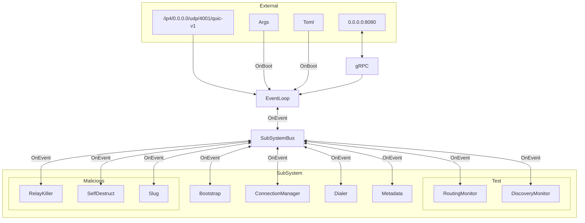

# System Overview
This crate builds 8 independent binaries:
- `bootstrap`
- `client`
- `server`
- `relay`
- `malicious_bootstrap`
- `malicious_client`
- `malicious_server`
- `malicious_relay`

Only one of these features can be enabled at a time.

Before building, ensure that you have `protoc` installed, as it is required for compiling gRPC proto files.

## Archetype
The system uses Rust feature flags to compile specific node roles. Each standalone binary is lightweight and role-specific.

| Role      | Responsability                                    |
|-----------|---------------------------------------------------|
| Bootstrap | Network entry point and DHT seed.                 |
| Relay     | Facilitates NAT traversal and traffic forwarding. |
| Server    | Domain operator node; provides services.          |
| Client    | End-user node, resolves and consumes services.    |

Malicious variants are compiled with additional sub-systems to validate network resilience under stress. Where normal nodes are designed to be maximally good to the network, malicious variants are designed to be maximally bad. As the project evolves, the network will handle more and more aggresive behaviours from malicious variants.

### Resilience
The degree of network resilience is determined by how many malicious nodes it can tolerate. The goal is to gradually increase the network's ability to withstand and recover from attacks.

Malicious behavior should not reflect actions that act against the malicious node’s own interests. Instead, tests will focus on realistic attack attempts that challenge the network’s robustness.

## Networking
This Proof of Concept (POC) uses the `libp2p` modular stack for peer-to-peer communication.

Configuration is archetype-specific.

## Control Plane (gRPC)
Each node exposes a programmatic interface via gRPC (using `tonic`).

This interface allows CLI tooling to:
1. Trigger manual dials.
2. Inspect routing table health.

You can interact with the node’s gRPC control plane using tools like:
- gRPCurl
- gRPC Web UI (https://grpc.io/)
- gRPC Gateway

This design philosophy aims to facilitate applications built on top of nodes, enabling other systems to communicate with nodes via gRPC. For example, you can hook up custom responses as a server and decide how to handle requests. Similarly, as a client, you can build a browser layer to interface with the network. gRPC is a well-rounded choice for this, although custom implementations are possible for network interactions.

## Architecture
Roles are feature-gated, ensuring each role is as lightweight and performant as possible.

